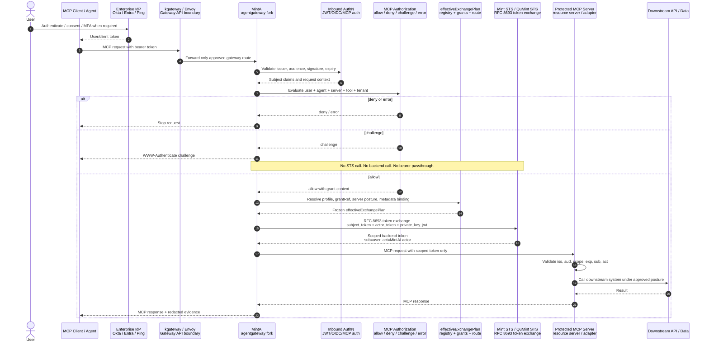

# MintAI

MintAI is a personal fork and product experiment built on Solo.io's open
source `agentgateway`. The goal is narrow on purpose: make an enterprise MCP
authentication, authorization, and token-exchange gateway that can replace
static API-key style access with standards-shaped, scoped, auditable delegated
tokens.

This repository should not expand into a full AI platform, DLP product, SIEM,
eval system, or model governance plane. Those are valid adjacent concerns, but
this fork's core workstream is MCP authn/authz and token minting.

## What MintAI Adds

Upstream `agentgateway` already provides an MCP/LLM/API gateway, admin UI,
traffic policy model, MCP authentication support, protected-resource metadata,
and CEL-based authorization surfaces.

MintAI extends that base toward this control model:

```text
MCP client / agent
        |
        | user/client token
        v
+-------------------------------+
| MintAI PEP               |
| agentgateway runtime          |
| - authenticate inbound token   |
| - gather request facts         |
| - enforce PDP decision         |
+---------------+---------------+
                |
                v
+-------------------------------+
| MintAI PDP               |
| extended MCP authorization     |
| allow / deny / challenge/error |
+---------------+---------------+
                |
        allow + exchange required
                |
                v
+-------------------------------+
| effectiveExchangePlan         |
| registry + grants + route      |
| profile + metadata binding     |
+---------------+---------------+
                |
                v
+-------------------------------+
| Mint STS / QuMint STS         |
| RFC 8693 token exchange        |
+---------------+---------------+
                |
                | scoped backend token only
                v
+-------------------------------+
| Protected MCP resource server |
| validates issuer/aud/scope/act |
+-------------------------------+
```

Detailed flow with Mint STS / QuMint STS:



## Security Roles

```text
PAP  Policy Administration Point
     MintAI admin UX and config/schema.

PIP  Policy Information Point
     MCP Server Registry, RFC 9728 metadata, user claims, tenant claims,
     server/tool metadata, backend posture, and workload identity facts.

PDP  Policy Decision Point
     Existing agentgateway MCP authorization extended to return a normalized
     allow / deny / challenge / error decision.

PEP  Policy Enforcement Point
     agentgateway/MintAI runtime. Blocks, challenges, calls STS, or forwards.

STS  Security Token Service
     Mint STS / QuMint STS implementing RFC 8693 token exchange.

RS   Resource Server
     Downstream MCP backend that validates scoped exchanged tokens.
```

## Accepted Architecture Decisions

Canonical decision log: <https://github.com/paul007ex/agentgateway/issues/30>

Current accepted decisions:

- MintAI is the MCP authn/authz/token-exchange gateway slice.
- PAP/PIP/PDP/PEP boundaries are explicit.
- The v1 PDP extends agentgateway's existing MCP authorization engine.
- PDP returns exactly `allow | deny | challenge | error`.
- Only `allow` may proceed toward STS exchange.
- STS is called only after PDP allow and `effectiveExchangePlan` resolution.
- Protected MCP backends receive only scoped exchanged tokens.
- v1 exchanged token semantics preserve `sub` as the original user and use
  `act` for the MintAI/gateway actor.
- Consent, reauth, and step-up are OAuth/MCP challenge flows through the client
  and IdP, not local gateway login screens.
- External challenge responses are `WWW-Authenticate` header-only. Detailed
  evidence stays in trusted admin/log/test surfaces.
- RFC 9728 protected-resource metadata is necessary but not sufficient. It must
  bind to an approved MCP Server Registry entry before `gatewayExchange`.
- v1 requires registered server posture plus backend TLS identity validation.
  mTLS/SPIFFE/workload identity is the stronger target posture where available.

## Standards Alignment

MintAI is intended to align with these protocol surfaces:

- MCP Authorization and MCP protected-resource behavior.
- RFC 9728 OAuth 2.0 Protected Resource Metadata.
- RFC 6750 bearer-token challenge semantics.
- RFC 8707 resource indicators.
- RFC 8693 OAuth 2.0 Token Exchange.
- RFC 9470 OAuth 2.0 step-up challenge semantics where supported.
- OpenID Connect Core claims and prompts for IdP-driven login, consent, reauth,
  and stronger authentication.

The important separation is:

```text
MCP/RFC metadata = standards discovery
MintAI registry = enterprise trust binding
PDP = authorization decision
STS = token exchange authority
```

## UI Direction

The local UI is branded as MintAI and uses a generic mint-green mark. It is
intentionally not tied to a vendor logo.

Current MintAI-specific UI surfaces:

```text
Security
  Key References
  PDP Profiles
  Token Exchange

MCP
  Servers
  Policies
  Authorization Matrix
  Tool Playground

Traffic
  Listeners
  Routes
```

The new Security and Authorization Matrix pages are currently placeholder/read
surfaces. They establish the information architecture before the schema and
runtime contracts are fully implemented.

## Implementation Plan

Recommended order:

```text
1. Schema spine
   tokenExchange profiles
   actorToken.source profiles
   keyRefs
   MCP Authorization Matrix
   MCP Server Registry / posture

2. Runtime decision spine
   extend MCP authz into normalized PDP
   add tenant/entitlement facts
   add challenge result support

3. Exchange plan
   resolve effectiveExchangePlan from registry, grants, route, profile,
   protected-resource metadata, and backend posture

4. STS runtime
   build self-issued gateway actor assertion path
   call Mint STS / QuMint STS using RFC 8693
   forward scoped token only

5. Backend contract
   protected MCP servers validate issuer, audience, scope, subject, actor,
   expiry, and signature

6. Evidence and tests
   prove fail-closed behavior
   prove no bearer leakage
   prove challenge means no STS/backend call

7. Real UX editors
   convert placeholder pages into schema-backed editors once runtime contracts
   are stable
```

## Issue Map

Key GitHub issues:

```text
#30 decision log
#16 tokenExchange profiles and backendAuth.gatewayExchange schema
#14 config implementation
#20 actorToken.source profiles
#21 keyRef resolver
#26 MCP authorization registry and grant matrix
#32 MCP server classification/posture registry
#31 normalized MCP PDP decision
#19 consent, reauth, and step-up
#35 concrete challenge response contract
#22 effectiveExchangePlan resolver
#18 actor assertion profiles
#23 selfIssuedActorAssertion runtime
#1  backendAuth.gatewayExchange RFC 8693 runtime
#5  protected backend scoped-token validation
#33 server workload identity / TLS binding
#25 fail-closed evidence matrix
#3  no bearer leakage proof
```

## Running The UI

```bash
cd ui
npm install
npm run dev
```

The UI expects the agentgateway admin API at `http://localhost:15000` by default.

Local development URL:

```text
http://localhost:19000
```

Build:

```bash
cd ui
npm run build
```

## Upstream

This fork is built on Solo.io's open source `agentgateway`:

<https://github.com/agentgateway/agentgateway>

Preserve upstream attribution and license notices when carrying changes forward.
